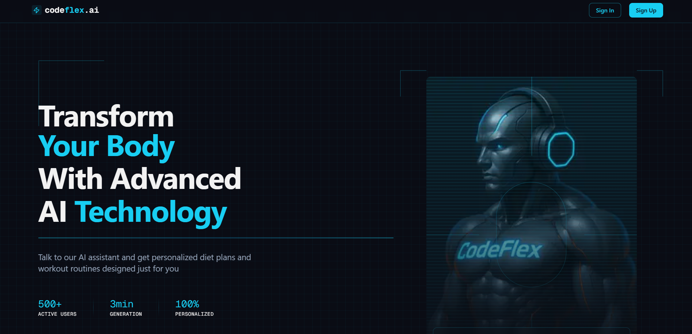

💪 AI Fitness Assistant 🤖

# Highlights

🚀 Tech stack: Next.js, React, Tailwind & Shadcn UI
🎙️ Voice AI Assistant (Vapi)
🧠 LLM Integration (Gemini AI)
🏋️ Personalized Workout Plans
🥗 Custom Diet Programs
🔒 Authentication & Authorization (Clerk)
💾 Database (Convex)
🎬 Real-time Program Generation
💻 Layouts
🎭 Client & Server Components

# Features

- Smart AI Assistant: Engage in conversation with an AI that asks about your fitness goals, physical condition, and preferences
- Personalized Workout Plans: Get custom exercise routines based on your fitness level, injuries, and goals
- Diet Recommendations: Receive personalized meal plans accounting for your allergies and dietary preferences
- User Authentication: Sign in with GitHub, Google, or email/password
- Program Management: Create and view multiple fitness programs with only the latest one active
- Responsive Design: Beautiful UI that works across all devices
